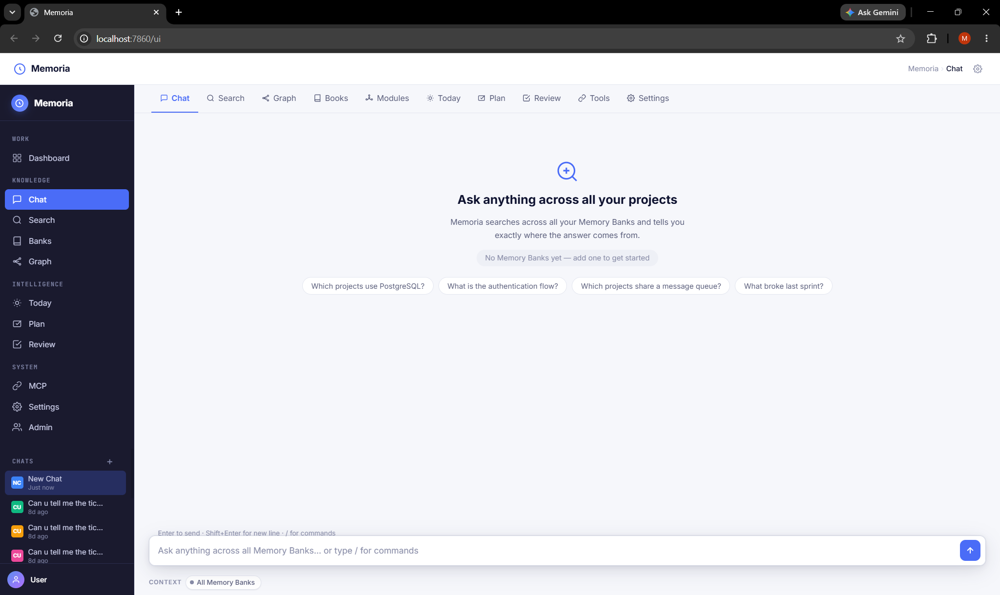
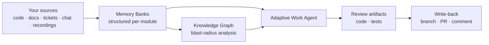

# Memoria Business

<p align="center">
  
</p>

<p align="center">
  
  
  
</p>

An adaptive AI work companion for engineering teams. Memoria pulls structured knowledge out of your codebases, docs, and tools — then uses it to assemble context for any ticket, detect what's missing, and help you ship.

---

## How it works



Your fragmented knowledge becomes structured **Memory Banks**. Those feed a **knowledge graph** (how everything connects) and an **adaptive agent** that assembles context for any ticket, generates artifacts for review, and proposes write-back actions — each confirmed by you.

---

## What it does

- **Memory Banks** — structured, AI-optimized summaries of how your systems work, generated from code repos, documents, recordings, and connected tools. Hierarchical: one bank per module/package, not one giant dump.
- **Knowledge Graph** — maps how every project and module relates to every other; blast-radius analysis for "what breaks if I change this?"
- **Adaptive Work Agent** — open a ticket and the system assembles the relevant Memory Banks, detects capability gaps (needs implementation, needs tests…), generates artifacts for review, and proposes write-back actions (branch, PR, Jira comment) — each requiring explicit confirmation.
- **Admin panel** — knowledge coverage health, consultant share tokens, RBAC, expert interview mode, and an append-only audit log.

It's model-agnostic via LiteLLM (Claude, OpenAI, Gemini, Bedrock, Ollama) and runs locally — Memory Banks live in your repo as plain Markdown.

---

## Quickstart

```bash
git clone https://github.com/sahilashra/Memoria
cd Memoria
pip install -e .

cp .env.example .env            # add your provider API key
cp config.example.yaml config.yaml

memoria init                    # pick AI provider + model
memoria analyze --repo ./your-project
memoria ui                      # open http://localhost:7860/ui
```

Live connectors (Jira, GitHub, Confluence) are optional — `pip install -e ".[mcp]"` and configure `mcp_sources` in `config.yaml`. The first moment of value needs only a repo and an API key.

---

## Docs

| Document | What's in it |
|---|---|
| [CAPABILITIES.md](CAPABILITIES.md) | Every feature in depth — analyzers, Memory Bank structure, CLI commands, MCP connectors, RBAC, config |
| [docs/architecture/SYSTEM_ARCHITECTURE.md](docs/architecture/SYSTEM_ARCHITECTURE.md) | Module map, data flow, storage layout |
| [docs/architecture/BUILD_ORDER.md](docs/architecture/BUILD_ORDER.md) | Phase 1 + Phase 2 build log |
| [docs/roles/](docs/roles/) | How each role (developer, QA, manager, designer) uses Memoria |

---

## License

MIT — free for personal and commercial use.
